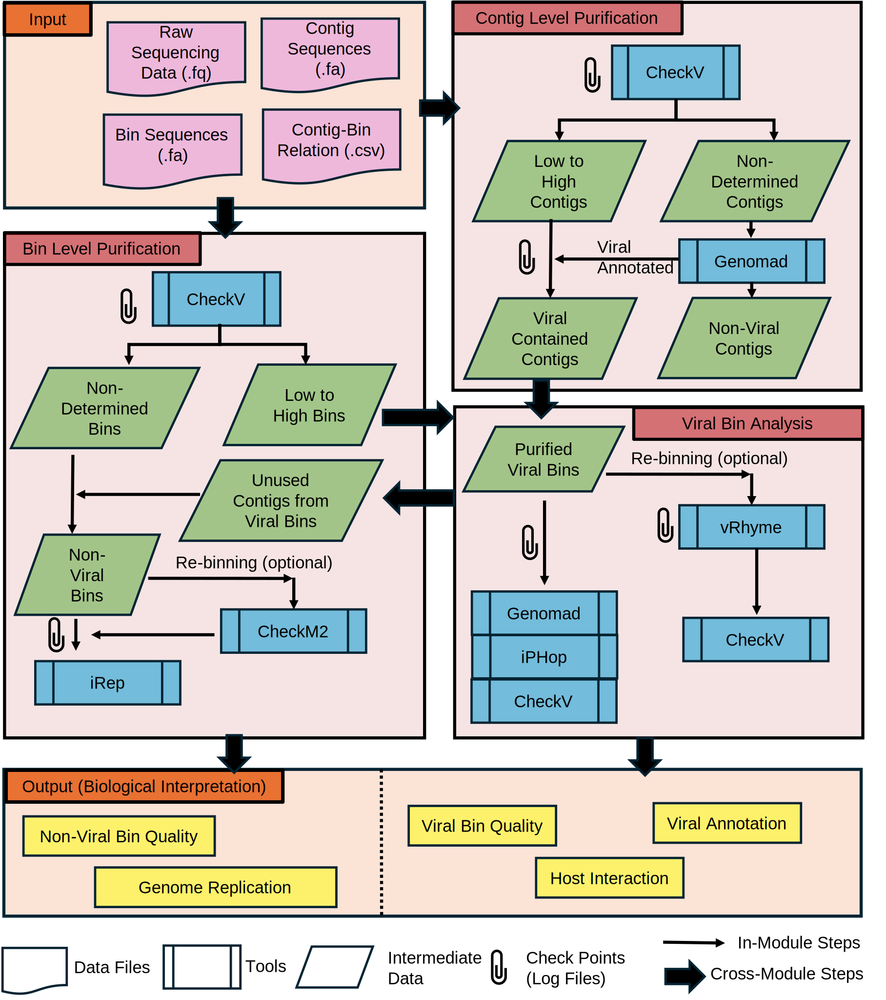

# metaIVP
# An Integrated Viral Pipeline
------------
## Table of Contents

## Table of Contents
* [Introduction](#1-introduction)
* [Installation](#2-installation)
* [Tutorial](#3-tutorial)
* [Output](#4-output)
* [Dependencies](#5-dependencies)
* [Log file structure](#6-log-file-structure)
* [Special tips for users](#7-special-tips-for-users)
## 1. INTRODUCTION

metaIVP
Integrated Viral Purification and Analysis Pipeline for Metagenomes

Overview

metaIVP is a modular and reproducible pipeline for viral genome identification, purification, and ecological interpretation from metagenomic assemblies.

Unlike conventional workflows that operate at a single resolution, metaIVP performs iterative refinement at both contig and bin levels, enabling:
Improved separation of viral and cellular signals
Recovery of high-quality viral genomes
Robust downstream analysis (annotation, host prediction, replication dynamics)

Workflow



-------------
## 2. INSTALLATION

```
git clone https://github.com/yao-laboratory/metaIVP
```

After the repo is cloned, user can run the following shell script to install their custom python environment.
Note: Users must have 'conda' and 'mamba' installed in their systems before proceeding with installation. This is a prerequisite.

```
export $USER_ENVIRONMENT

 ./install.sh
```
User can either run install.sh or install dependecies individually.


2.1. Input

Required inputs:

a) Viral contigs: contigs.fasta obtained from viral reads (contigs_v)

b) Viral reads: paired-end viral metagenomic whole genome sequences (WGS: $fasq1_v,$fastq2_v)

c) Bins: Viral bins obtained from contigs ($bins_folder)

d) Assembled proteins: Table_3 consisting of assembly protein level information ($table3_v)

e) Threads: Number of threads ($t)

f) Databases: Path to installed databases (genomad, checkv etc. In our case, we only Genomad's external database; $genomad_db)


2.2 Example commands

The following commands can be used as an example to run metaIVP pipeline:


```
$metaIVP_path/main.sh  $contigs_v  $table3_v $output_path $bins_folder $t $genomad_db  $fastq1_v $fastq2_v
```

-------------
## 3. TUTORIAL

```
STEP 0: Download fastq files from NCBI (http://ncbi.nlm.nih.gov)

```
```
fastq-dump --split-files SRR23196529

```

```
STEP 1: Update the stand alone job script with input parameters available in the example folder.
```

```
metaIVP_path=/home/metaIVP
export USER_ENV_NAME=metaIVP_env
fastq1=SRR23196529_1.fastq
fastq2=SRR23196529_2.fastq
sample_ID=SRR23196529
contigs_v=$metaIMP_path/contigs.fasta (users can have their own contigs, we recommend to use metaIMP pipeline first)
table_3=$metaIMP_path/ASSEMBLY_SNP_ANNOTATION/Table_3_assembly_complete_protein.csv
threads=8
```

The following shows USER INPUT in the following order: A) required inputs from users B) Environment dependencies C) fixed input for metaIVP

```
#viral paired-end forward read
fastq1_v=$path/to/SRR23196529_1.fastq
#viral paired-end reverse read
fastq2_v=$path/to/SRR23196529_2.fastq
#viral contigs
contigs_v=$path/to/contigs.fasta
#contig_bin_relation=
table3_v=$path/to/Table_3_assembly_complete_protein.csv


##############################################################
#USER DOES NOT NEED TO CHANGE ANYTHING FROM HERE
##############################################################


#FIXED INPUT

contigs_m=$contigs_v
fastq1_m=$fastq1_v
fastq2_m=$fastq2_v
quality_summary=path/to/any/csv/file
bins_folder=path/to/any/bins/folder
bins_folder_m=bins_folder

##############################################################
##############################################################


source activate $USER_ENV
echo "$metaIVP_path/main.sh $contigs_m $contigs_v $table3_m $table3_v $output_path $bins_folder $t $quality_summary $genomad_db $fastq1_m $fastq2_m $fastq1_v $fastq2_v"
$metaIVP_path/main.sh $contigs_m $contigs_v $table3_m $table3_v $output_path $bins_folder $t $quality_summary $genomad_db $fastq1_m $fastq2_m $fastq1_v $fastq2_v

source deactivate
```

STEP 2: Submit job

* Submit stand alone job for assembly pipeline using the stand alone example jobs as shown in the example scripts. We recommend to submit SLURM jobs instead of interactive node execution, especially for samples >20G. 


```
sbatch example_stand_alone_job_metaIVP.sh
(or)
bash ./example_stand_alone_job_metaIVP.sh
```

STEP 3: Verify results
* Users can verify the results in the output folder generated by metaIVP. Two key folders are created, each with bin (purify_bins) and contig (purify_contigs) level information. User can access 'log folder' to track internal processes of metaIVP.


-------------
## 4. OUTPUT

This section describes the output folder structure and provides description for important files/folders.
<pre>
metaIVP OUTPUT FOLDER

.
├── log_folder/
├── purify_virus_contigs/
│   ├── contigs_determined.fasta
│   ├── contigs_determined.csv
│   ├── contigs_not_determined.fasta
│   ├── checkv_on_contigs/
│   │   └── quality_summary.tsv
│   └── genomad_on_contigs_v/
│       └── contigs_summary/
│           ├── contigs_summary.json
│           └── contigs_virus_summary.tsv

├── purify_virus_bins/
│   ├── bins_virus.fasta
│   ├── bins_not_virus.fasta
│   ├── viral_bin_scaffold.csv
│   ├── viral_bin_scaffold_clean.csv
│   ├── not_viral_bin_scaffold.csv

│   ├── before_purify/
│   │   └── quality_summary.tsv

│   ├── virus/
│   │   ├── checkv/
│   │   │   └── quality_summary.tsv
│   │   ├── genomad/
│   │   │   └── bins_virus_summary/
│   │   │       ├── bins_virus_summary.json
│   │   │       └── bins_virus_virus_summary.tsv
│   │   └── iphop/
│   │       ├── bins_virus_clean.fna
│   │       └── Wdir/
│   │           └── All_scores_iPHoP_by_instance.csv

│   ├── non_virus/
│   │   ├── CHECKM_2/
│   │   │   └── quality_report.tsv
│   │   └── irep/
│   │       └── replication_irep.csv

│   └── purify_vhryme_checkv_binning/
│       ├── bin_determined.fasta
│       ├── Modified_Coverage.tsv
│       ├── checkv_for_bin_determined/
│       │   └── quality_summary.tsv
│       ├── checkv_with_VRhyme/
│       │   └── quality_summary.tsv
│       ├── genomad_for_bin_determined/
│       │   └── bin_determined_summary/
│       │       ├── bin_determined_summary.json
│       │       └── bin_determined_virus_summary.tsv
│       └── virus_binning/
│           └── vrhyme_output/
│               ├── vRhyme_best_bins.summary.tsv
│               └── vRhyme_best_bins.membership.tsv


</pre>


Output Dataframes:


| Dataframe	| Description |
| ------------- | ----------- |
| replication_irep      | Replication rate consolidated file for each purified bin |
| contigs_determined.csv      | Determined viral contigs |
| contigs_not_determined.csv      | Non-Determined viral contigs (moved to metagenome side) |
| quality_summary.csv       | CheckV quality summary |
| virus_summary.csv       | Genomad viral quality summary |
| virus_taxonomy.csv       | Genomad viral taxonomy summary |
| vRhyme_best_bins.membership.tsv | vrhyme membership file for viral bins |


-------------
## 5. DEPENDENCIES 

This section describes tools/modules required by metaIVP:


A) Python environment > v3.5

B) Tools list: 1) CheckV 2) Genomad 3) vRhyme 4) iPHop 5) CHECKM2 6) Samtools 7) Bowtie2 8) iRep 

-------------
## 6. LOG FILE STRUCTURE

6.1. Log file list:

A) purify_contigs.log : 1) purify_contigs_checkv.log 2) purify_contigs_genomad.log

B) purify_bins.log : 1) purify_bins_checkv.log 

C) post_processing_non_virus.log : 1) post_processing_non_virus_samtools.log 2)post_processing_non_virus_binning.log 3) post_processing_non_virus_irep.log 4) post_processing_non_virus_checkm2.log


D) post_processing_viral_binning.log: 1) post_processing_virus_checkv.log 2) post_processing_virus_genomad.log 3) post_processing_virus_iphop.log 4) post_processing_virus_binning_vrhyme.log 5) post_processing_virus_checkv_with_vrhyme.log


6.2. Log file description:


purify_contigs.log: General log for contig purification steps.
purify_contigs_checkv.log: Tracks quality checks on contigs during purification with CheckV.
purify_contigs_genomad.log: Logs contamination detection on contigs during purification using Genomad.

purify_bins.log: Records bin purification processes.
purify_bins_checkv.log: Logs quality control of bins during purification using CheckV for contig level purification.
purify_contigs_genomad.log : Logs genomad process for contig level purification.    

post_processing_non_virus.log: General log for non-viral post-processing steps.
post_processing_non_virus_binning.log: Logs the binning process for non-viral genomic data.
post_processing_non_virus_samtools.log: Logs alignment and mapping stats for non-viral data using samtools.
post_processing_non_virus_checkm2.log: Records quality assessment of non-viral bins using CheckM2.
post_processing_non_virus_irep.log: Tracks replication rate analysis on non-viral genomes with iRep.


post_processing_virus.log: General log of viral genome post-processing steps.
post_processing_virus_iphop.log: Logs phage-host interaction predictions with iPHoP.
post_processing_virus_genomad.log: Records contamination detection on viral genomes with Genomad.
post_processing_virus_checkv.log: Logs viral genome quality checks using CheckV.

post_processing_viral_binning.log: Documents viral genome binning operations.
post_processing_virus_binning_vrhyme.log : Documents viral bins generated from vRhyme.

-------------
## 7. SPECIAL TIPS FOR USERS

1) All the INPUT files for metaIVP were obtained from metaIMP (https://github.com/yao-laboratory/metaIMP). Users can either run metaIMP assembly pipeline/generate their own input files.

2) In the example script, we ignore anything tagged with "underscore m". These inputs can be same "underscore v" inputs.

3) Utitity folder: Consists of "MVP_Utility" folder, for users to execute MVP pipeline (https://gitlab.com/ccoclet/mvp). "MVP_CHECK_GENOMAD" shell script allows post-processing of MVP-7B, viral fasta generated by this pipeline.

4) Log folder: metaIVP is a RESUSABLE, REPRODUCIBLE program, and not a bash script. Users can utilize the log folder functionality, to either run specific internal dependencies, or run the entire pipeline.
